# Scientific Image Forgery Detection

> **Dual-task deep learning** — classify scientific images as *authentic* or *forged*, and **localise** the copied region pixel-by-pixel.

[](LICENSE)
[](https://pytorch.org)
[](https://streamlit.io)
[](https://www.kaggle.com/competitions/recodai-luc-scientific-image-forgery-detection)

Four trained models, a unified evaluation harness, and a **local Streamlit web app** that lets you drop in any image and see which pixels are forged — all running on a 4 GB consumer GPU.

---

## Headline result

A side-by-side comparison of all four models on the held-out validation set (713 samples):

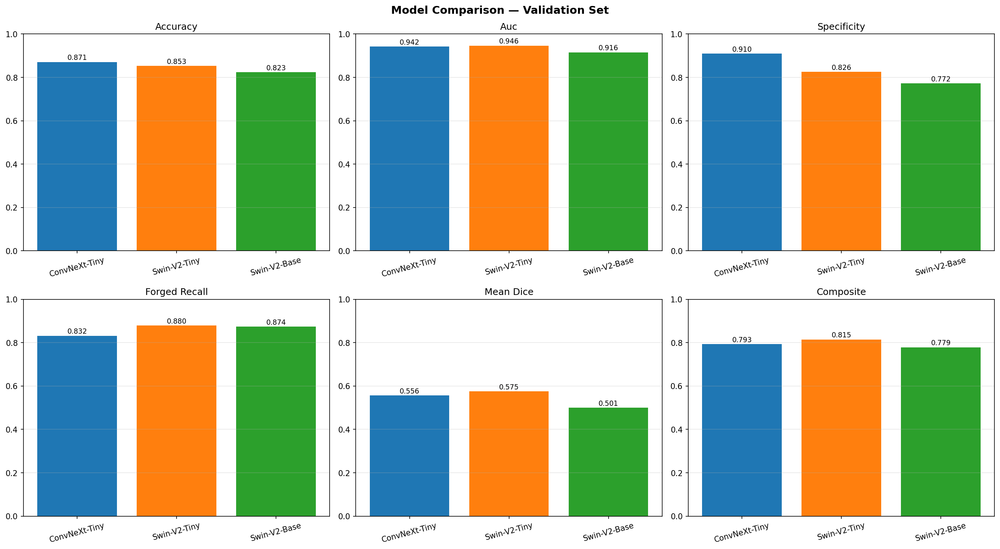

| Rank | Model | AUC | F1 | Specificity | Dice | Composite |
|------|-------|-----|-----|------------|------|-----------|
| 🥇 1 | **Swin-V2-Tiny** | **0.9463** | 0.8568 | 0.8258 | **0.5755** | **0.8150** |
| 🥈 2 | ConvNeXt-Tiny | 0.9421 | 0.8659 | **0.9101** | 0.5562 | 0.7933 |
| 🥉 3 | Swin-V2-Base | 0.9157 | 0.8320 | 0.7725 | 0.5005 | 0.7786 |
|      | EfficientNet-B4 (baseline) | 0.8433 | 0.7612 | 0.5309 | 0.5043 | 0.7588 |

**Swin-V2-Tiny wins on AUC, Dice and the composite metric.** The bigger Swin-V2-Base loses to its Tiny variant — a textbook "capacity outpaces data" outcome that is itself a useful experimental finding.

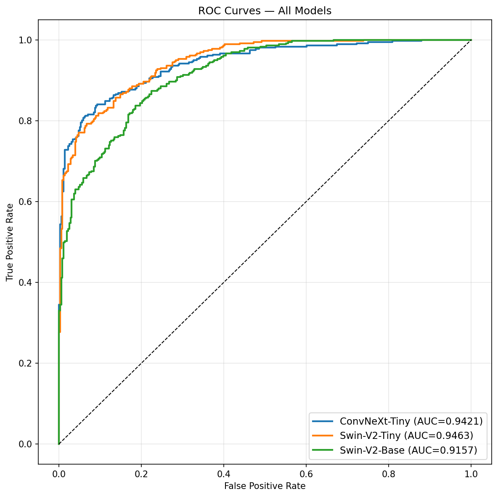

---

## Architecture

All four models share a **CBAM-UNet decoder with deep supervision**; only the encoder backbone changes.

```
Input image  [B, 3, 512, 512]
    │
    ▼
   ENCODER  (5 levels for EfficientNet/ResNet  ·  4 levels for ConvNeXt/Swin)
    │
    ├─► Classification head:  GlobalAvgPool → FC(512) → Dropout → FC(1) → logit
    │
    └─► CBAM-UNet decoder:
          d_top    + skip + CBAM   ─► aux_head_top  (deep supervision)
          d_mid    + skip + CBAM   ─► aux_head_mid  (deep supervision)
          d_low    + skip + CBAM
          d_final  (no skip)
          seg_head (1×1 conv)        →  [B, 1, 512, 512]   pixel-wise mask
```

**CBAM** = channel attention (squeeze-and-excitation style) + spatial attention (7×7 conv on avg+max channel maps).
**Deep supervision** = auxiliary mask heads at intermediate decoder depths, providing direct gradient signal for spatial localisation.

| Encoder | Levels | Params | Built-in attention |
|---------|--------|-------:|--------------------|
| EfficientNet-B4 | 5 | 19 M | Squeeze-Excitation |
| ResNet-50 | 5 | 25 M | none |
| ConvNeXt-Tiny | 4 | 28 M | none — sharper local features |
| **Swin-V2-Tiny** ★ | 4 | 28 M | windowed self-attention |
| Swin-V2-Base | 4 | 88 M | windowed self-attention |

★ = production deployment recommendation

---

## How to run the local web app

The Streamlit app provides four tabs: **Single Image** · **Batch / Folder** · **Compare Models** · **Performance**.

### 1. Clone and install

```bash
git clone https://github.com/jp-0704/<REPO>.git
cd <REPO>/webapp
python3 -m venv .venv
source .venv/bin/activate            # Windows: .venv\Scripts\activate
pip install -r requirements.txt
```

### 2. Download model weights

The four trained checkpoints are attached as a [GitHub Release](../../releases) (they are too large for the repo). Download them into `webapp/models/`:

```bash
cd webapp/models
gh release download v0.1.0 --repo jp-0704/<REPO>
# or download manually from the Releases page
```

Any `.pt` filename works — architecture is auto-detected from the saved metadata or the state-dict structure.

### 3. Launch

```bash
cd ..      # back to webapp/
streamlit run app.py
```

Browser opens at `http://localhost:8501`. The app uses **FP16 + 4-fold TTA** with auto-fallback to no-TTA → CPU on `OutOfMemoryError`. Inference time on a 4 GB consumer GPU is **0.4–1.2 s per image**.

---

## Repository layout

```
.
├── README.md                           you are here
├── REPORT.md                           full technical write-up
├── PLAN.txt  RUNBOOK.md                project plan and execution guide
├── LICENSE                             MIT
│
├── webapp/                             local Streamlit app
│   ├── app.py                          Entry, 4 tabs
│   ├── arch.py                         CBAM, DecoderBlock, FiveLevelUNet, FourLevelUNet
│   ├── inference.py                    Auto-discovery, FP16, TTA, OOM fallback
│   ├── components.py                   UI primitives, performance dashboard
│   ├── requirements.txt
│   └── README.md                       app-specific run guide
│
├── _build_notebooks.py                 generator for the 3 training notebooks
├── train_1_convnext_tiny.ipynb         Kaggle training, ~3 h on 1× T4
├── train_2_swin_v2_tiny.ipynb          ~4 h
├── train_3_swin_v2_base.ipynb          ~10 h, with gradient checkpointing
├── compare_models.ipynb                cross-model evaluation
│
├── review-1.ipynb                      original baseline pipeline (EfficientNet-B4)
├── review-final.ipynb                  cleaned baseline rewrite
├── review2.ipynb                       baseline evaluation (with outputs)
├── convnext-tiny_output.ipynb          ConvNeXt-Tiny training (with outputs)
│
└── outputs/                            18 MB of training/eval artefacts
    ├── baseline_efficientnet_b4/       7 files
    ├── train_1_convnext_tiny/          4 files
    ├── train_2_swin_v2_tiny/           5 files (incl. history.csv)
    ├── train_3_swin_v2_base/           5 files
    └── comparison/                     comparison_dashboard.png, roc_overlay.png,
                                        comparison.csv, winner.json
```

---

## Per-model artefacts

Each training notebook writes a self-contained directory of artefacts. Click a model name to see the training curves, validation dashboard, and qualitative predictions for that run.

<details>
<summary><strong>EfficientNet-B4 baseline</strong>  ·  AUC 0.8433  ·  Dice 0.5043</summary>

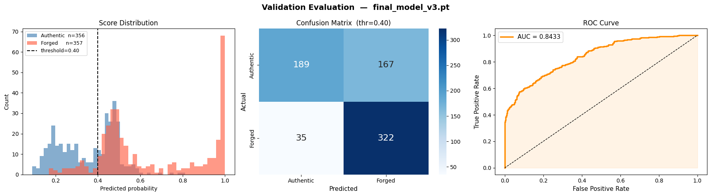
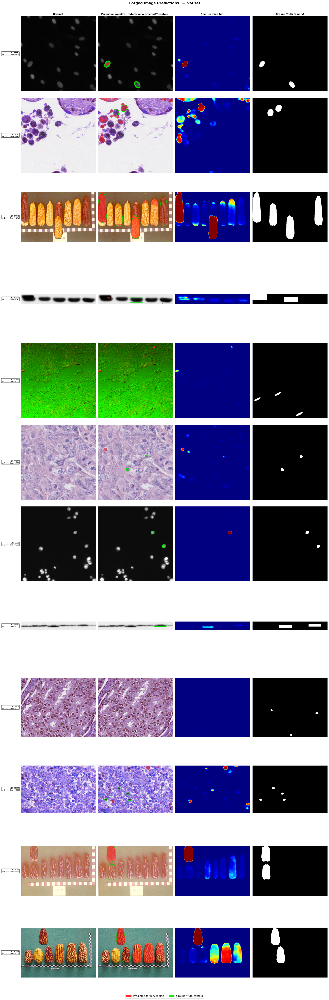
</details>

<details>
<summary><strong>ConvNeXt-Tiny</strong>  ·  AUC 0.9421  ·  Spec 0.9101  ·  Dice 0.5562</summary>

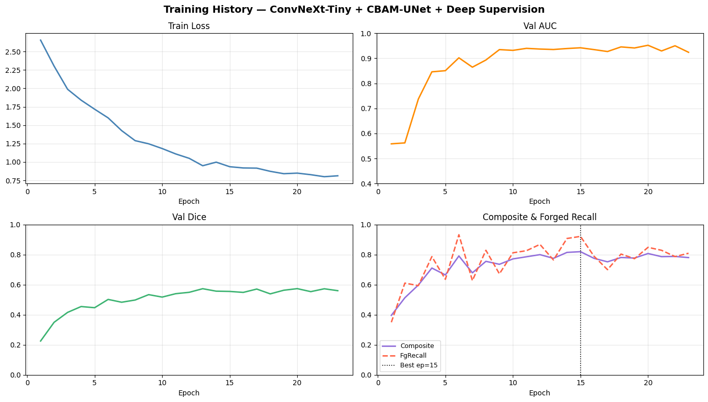
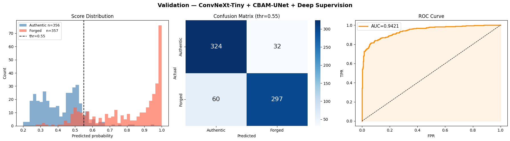
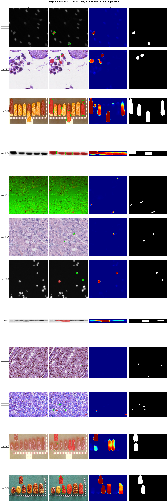
</details>

<details>
<summary><strong>Swin-V2-Tiny ⭐</strong>  ·  AUC 0.9463  ·  Dice 0.5755  ·  Composite 0.8150</summary>

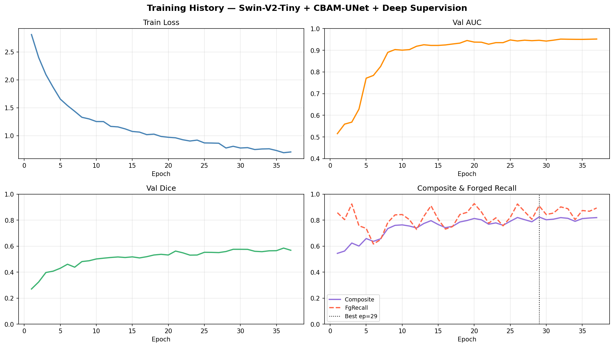
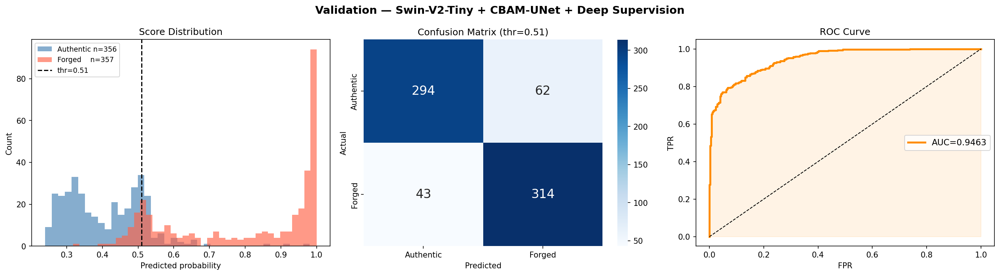
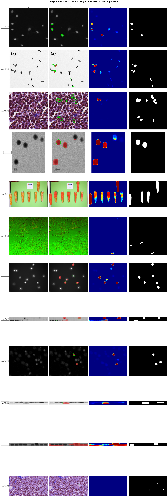
</details>

<details>
<summary><strong>Swin-V2-Base</strong>  ·  AUC 0.9157  ·  Dice 0.5005  ·  Composite 0.7786 (overfit)</summary>

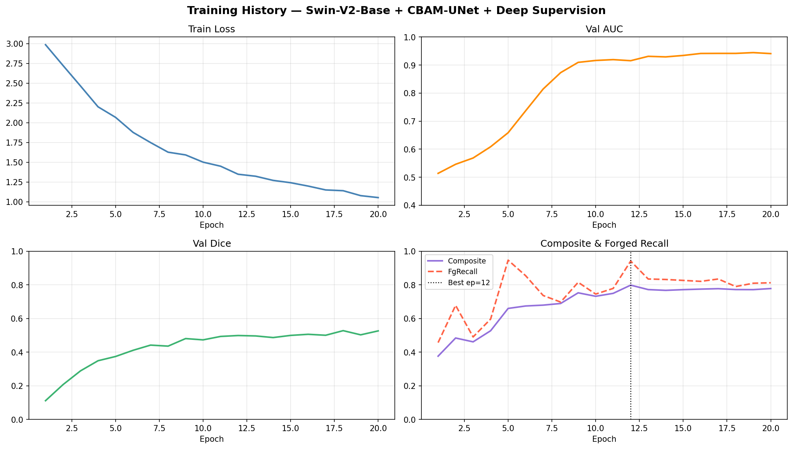
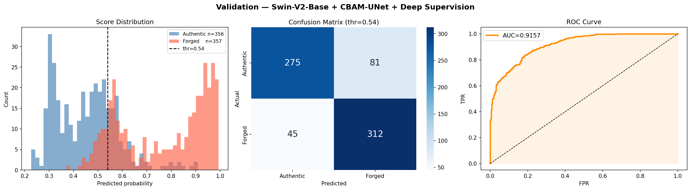

</details>

---

## Reproducing training

Each training notebook is self-contained and runs on Kaggle in a single GPU session. To reproduce:

1. Open the corresponding `train_X_*.ipynb` on Kaggle.
2. Attach the **RECOD.ai Scientific Image Forgery Detection** competition dataset.
3. Set accelerator to **GPU T4 x2** (single GPU is also fine).
4. Run all cells. The smoke-test cell catches OOM/shape errors in 30 s before the full loop.

Key reproducibility guarantees:
- `SEED=42` for `random`, `numpy`, `torch`, `torch.cuda`
- Sorted UID list before shuffle → deterministic train/val split
- All four models evaluated on the **same 713-sample validation subset**
- Saved checkpoints carry `cls_threshold` + `val_auc` + `val_dice` metadata for full self-description

Detailed methodology, loss function derivations, hyperparameters, and the engineering-failure post-mortem are in [REPORT.md](REPORT.md).

---

## Key engineering decisions

| Decision | Choice | Why |
|----------|--------|-----|
| Decoder | Shared CBAM-UNet across all encoders | Apples-to-apples comparison; isolates encoder effect |
| Multi-GPU | Permanently disabled (single GPU + AMP) | DataParallel + AMP + ConvNeXt/Swin permute hits a `cudaErrorMisalignedAddress` bug; T4 single-GPU FP16 is 4× faster than 2-GPU FP32 anyway |
| DataLoader workers | `num_workers=0` | Kaggle's `/dev/shm` is too small for sampler queues — workers die silently |
| Mixed precision | AMP on, `cudnn.deterministic=False` | Strict deterministic kernels break alignment for Linear-after-permute |
| Threshold | Per-model F1 sweep | Each architecture has a distinct calibration sweet spot (0.40 / 0.55 / 0.51 / 0.54) |
| Webapp deployment | Local + RTX 3050 Ti | FP16 + sequential TTA fits in 4 GB; fallback to CPU on OOM |
| Model auto-discovery | State-dict-based architecture detection | Drop any `.pt` filename — the webapp identifies it from the saved metadata + key shapes |

---

## Live demo

The webapp itself is intended to run **locally** on your machine because it loads ~675 MB of model weights and uses GPU acceleration. To deploy a hosted version on the free tier of Hugging Face Spaces:

1. Create a new Space at <https://huggingface.co/new-space> with SDK = **Streamlit**
2. Upload the contents of `webapp/` (use `huggingface-cli upload` or git push)
3. Upload `efficientnet_b4.pt` to the Space's `/models/` directory (HF Spaces support files up to 5 GB)
4. The Space URL becomes your live demo

For a static screenshot tour of the app, see the **Performance** tab artefacts in [`outputs/comparison/`](outputs/comparison).

---

## Citation

If this code or the trained weights help your research, please cite:

### IEEE

> Jayavikram, "Scientific Image Forgery Detection: Dual-Task Deep Learning with CBAM-UNet," version 0.1.0, GitHub, 2026. [Online]. Available: https://github.com/jp-0704/scientific-image-forgery-detection

### APA (7th edition)

> Jayavikram. (2026). *Scientific image forgery detection: Dual-task deep learning with CBAM-UNet* (Version 0.1.0) [Computer software]. GitHub. https://github.com/jp-0704/scientific-image-forgery-detection

### BibTeX (for LaTeX users)

`@software` is the modern biblatex entry type for code. Use `@misc` if your document class doesn't support it.

```bibtex
@software{jayavikram2026forgery,
  author  = {{Jayavikram}},
  title   = {Scientific Image Forgery Detection: Dual-Task Deep Learning with CBAM-UNet},
  year    = {2026},
  version = {0.1.0},
  url     = {https://github.com/jp-0704/scientific-image-forgery-detection}
}
```

```bibtex
@misc{jayavikram2026forgery,
  author       = {{Jayavikram}},
  title        = {Scientific Image Forgery Detection: Dual-Task Deep Learning with CBAM-UNet},
  year         = {2026},
  howpublished = {\url{https://github.com/jp-0704/scientific-image-forgery-detection}},
  note         = {GitHub repository, version 0.1.0}
}
```

> The double braces `{{Jayavikram}}` are intentional — they tell BibTeX to treat the name as one atomic unit instead of trying to split it into first/last components.

GitHub also displays a **"Cite this repository"** button at the top-right of the repo page (in the *About* sidebar) that auto-generates BibTeX, APA, and other formats from this project's [`CITATION.cff`](CITATION.cff) on click.

---

## License

MIT — see [LICENSE](LICENSE).

The training data referenced by this repository is the [RECOD.ai Scientific Image Forgery Detection](https://www.kaggle.com/competitions/recodai-luc-scientific-image-forgery-detection) Kaggle competition dataset and is **not** redistributed here. To reproduce training, attach the dataset to your own Kaggle session.
